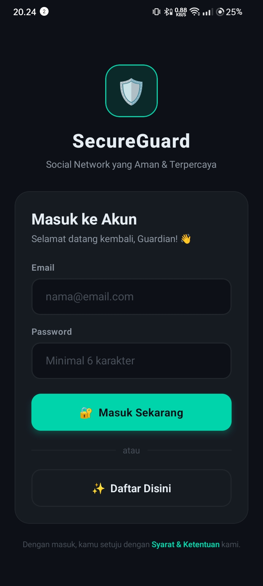
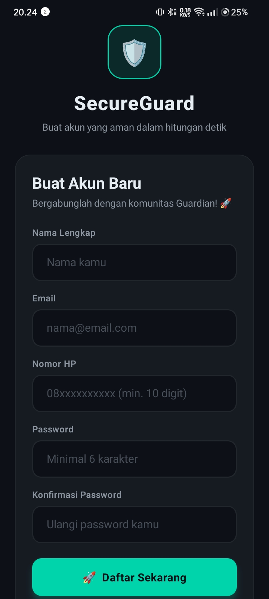
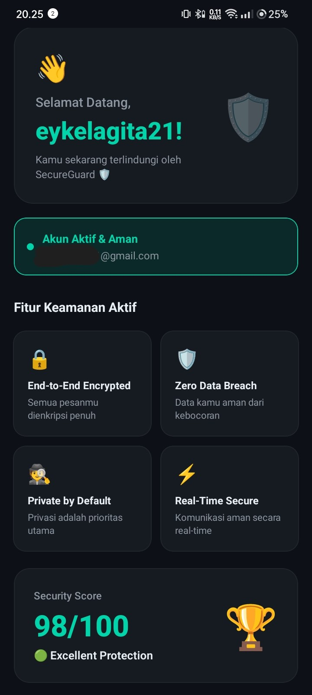

# 🛡️ SecureGuard — Misi 5: Protect the Social Network

> *"A good dev builds a feature. A great dev builds a secure experience."* 🦾🔥

---

## 📱 Deskripsi Aplikasi

**SecureGuard** adalah aplikasi autentikasi React Native bertema *Social Network Security*. Memiliki 3 screen utama (**Login**, **Register**, **Home**) dengan validasi keamanan berlapis dan UI dark-mode yang polished.

---

## 🔗 Link Penting

| Resource | Link |
|---|---|
| 📦 **Expo Snack** | [Buka di Expo Snack](https://snack.expo.dev/@eykel21/the-secure-guard) |
| 💻 **GitHub Repository** | [github.com/username/secureguard-misi5](https://github.com/username/secureguard-misi5) |

> ⚠️ Ganti `username` dengan username Expo Snack & GitHub kamu setelah upload.

---

## 📸 Screenshot Running Program

### Screen 1 — Login


### Screen 2 — Register


### Screen 3 — Home


> 💡 Jalankan app → screenshot tiap screen → simpan di `assets/screenshots/`

---

## ✅ Checklist Rubrik

### 📋 Fitur
| Fitur | Status |
|---|---|
| Screen 1 — Email, Password, Tombol "Daftar Disini" | ✅ |
| Screen 2 — Nama, Email, Phone, Password, Confirm Password | ✅ |
| Screen 3 — Welcome + nama user yang login/daftar | ✅ |

### 🛡️ Security Logic
| Validasi | Status | Detail |
|---|---|---|
| Validasi Email (RegEx) | ✅ | `/^[^\s@]+@[^\s@]+\.[^\s@]+$/` |
| Validasi Phone (angka only + min 10 digit) | ✅ | Auto-strip non-angka + cek panjang |
| Match Check Password | ✅ | Real-time indicator + cek saat submit |
| Handle Keyboard | ✅ | `KeyboardAvoidingView` iOS & Android |

### 🚀 Submission
| Item | Status |
|---|---|
| Push ke GitHub | ✅ |
| README + Screenshot | ✅ |
| Link Expo Snack | ✅ |

---

## 🗂️ Struktur Project

```
SecureGuard/
│
├── 📄 App.js                        ← Root (Expo Snack: 1 file; VS Code: navigator)
│
├── src/
│   ├── screens/
│   │   ├── LoginScreen.js           ← Screen 1: Login
│   │   ├── RegisterScreen.js        ← Screen 2: Register
│   │   └── HomeScreen.js            ← Screen 3: Home
│   │
│   ├── components/
│   │   └── InputField.js            ← Reusable secure input
│   │
│   ├── utils/
│   │   └── validation.js            ← Semua fungsi validasi
│   │
│   └── constants/
│       └── colors.js                ← Color tokens
│
├── assets/screenshots/              ← Screenshot untuk README
├── app.json
├── babel.config.js
├── package.json
└── README.md
```

> **Expo Snack:** Cukup gunakan satu file `App.js` (versi snack)  
> **VS Code:** Gunakan struktur folder lengkap di atas

---

## 🛡️ Detail Security Logic

### 1. Validasi Email
```javascript
const validateEmail = (email) => {
  const regex = /^[^\s@]+@[^\s@]+\.[^\s@]+$/;
  return regex.test(email.trim());
};
```

### 2. Validasi Phone
```javascript
const validatePhone = (phone) => {
  const digitsOnly = phone.replace(/\D/g, '');
  return digitsOnly.length >= 10;
};
// Di onChangeText: t.replace(/\D/g, '') → cegah input non-angka
```

### 3. Match Check Password
```javascript
if (password !== confirmPassword) {
  errors.confirmPassword = 'Password tidak cocok!';
}
// + real-time indicator: passwordsMatch / passwordsMismatch
```

### 4. Handle Keyboard
```jsx
<KeyboardAvoidingView
  behavior={Platform.OS === 'ios' ? 'padding' : 'height'}
  keyboardVerticalOffset={Platform.OS === 'ios' ? 0 : 24}
>
  <ScrollView keyboardShouldPersistTaps="handled">
    {/* content + tombol Submit tidak tertutup keyboard */}
  </ScrollView>
</KeyboardAvoidingView>
```

---

## 🚀 Cara Menjalankan

### Via Expo Snack (tanpa install)
1. Buka link Expo Snack di atas
2. Scan QR dengan **Expo Go** (Android/iOS)

### Via VS Code + Lokal
```bash
# Clone repo
git clone https://github.com/username/secureguard-misi5.git
cd secureguard-misi5

# Install dependencies
npm install

# Jalankan
npx expo start

# Scan QR dengan Expo Go, atau tekan:
# a → Android Emulator
# i → iOS Simulator
```

---

## 🎨 Tech Stack & Desain

| Aspek | Detail |
|---|---|
| Framework | React Native + Expo ~51 |
| Navigation | State-based (useState) |
| Validasi | Custom RegEx & logic |
| Keyboard | KeyboardAvoidingView + ScrollView |
| Tema | Dark mode — cybersecurity aesthetic |
| Warna | `#0D1117` bg · `#00D4AA` accent · `#FF6B6B` error |

---

## 👨‍💻 Dibuat oleh

**[Eykel Agitha Kembaren]** · Praktikum Mobile Programming · Misi 5

---
*Built with 🛡️ React Native & Expo*
